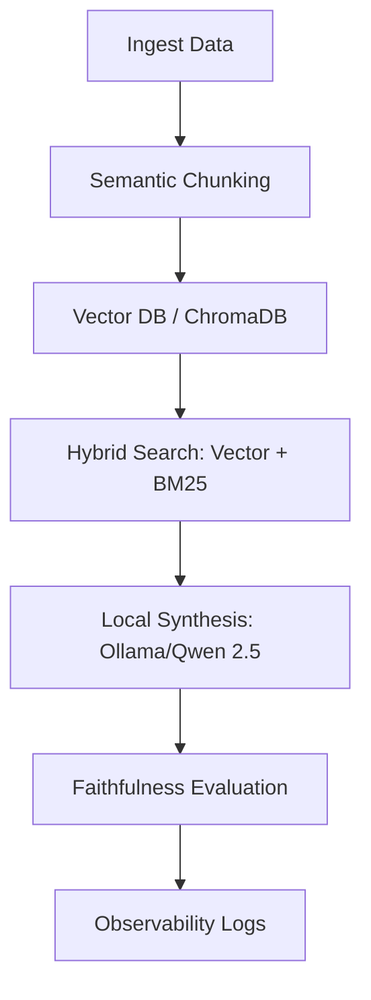

# Singapore HDB Policy RAG

An end-to-end Retrieval-Augmented Generation (RAG) pipeline designed to query and synthesize information from Singapore HDB policy documents. This project implements advanced RAG techniques including hybrid search, semantic chunking, and automated faithfulness evaluation, all running locally.

## Pipeline Logic Flow



## Features


- **Automated Policy Ingestion**: Scrapes and parses HDB eligibility pages (e.g., Singles Scheme) using BeautifulSoup.
- **Semantic Chunking**: Utilizes logic-based recursive character splitting to preserve context and sentence integrity, avoiding the pitfalls of naive fixed-size chunking.
- **Hybrid Search Architecture**: Combines semantic vector search (ChromaDB + Sentence Transformers) with keyword-based search (BM25) to ensure high retrieval precision for both conceptual and specific term-based queries.
- **Local LLM Synthesis**: Connects to Ollama (Qwen 2.5) for local, privacy-focused answer generation without external API dependencies.
- **RAG Observability**: Integrated SQLite-based logging system to track queries, retrieved contexts, and generated answers for iterative debugging.
- **Faithfulness Evaluation**: A custom evaluation harness that scores generated answers based on their adherence to the retrieved context, identifying potential hallucinations.

## Tech Stack

- **Language**: Python 3.11+
- **LLM Engine**: Ollama (Qwen 2.5 3B)
- **Vector Store**: ChromaDB
- **Embeddings**: `all-MiniLM-L6-v2` (Sentence-Transformers)
- **Retrieval**: BM25 (RankBM25)
- **Orchestration**: LangChain (Text Splitters)

## Project Structure

- `ingest_policies.py`: Scraper and chunking logic.
- `build_vector_db.py`: Vector database initialization and population.
- `hybrid_search.py`: Core retrieval engine combining Vector + BM25 scores.
- `local_synthesis.py`: Interface for generating responses via Ollama.
- `eval_harness.py`: Evaluation system for testing RAG reliability.
- `observable_rag.py`: Logging and monitoring implementation.
- `advanced_retrieval.py` / `meta_filtering.py`: Experimental retrieval techniques and metadata management.

## Setup & Usage

### 1. Prerequisites
- [Ollama](https://ollama.com/) installed and running.
- Pull the required model: `ollama pull qwen2.5:3b`.

### 2. Installation
```bash
# Clone the repository
git clone https://github.com/wlsoo1214/Singapore-HDB-Policy-RAG.git
cd Singapore-HDB-Policy-RAG

# Create and activate virtual environment
python -m venv venv
source venv/bin/activate

# Install dependencies
pip install -r requirements.txt
```

### 3. Running the Pipeline
```bash
# Ingest data and build the vector database
python build_vector_db.py

# Run the RAG system with a query
python local_synthesis.py

# Run evaluations
python eval_harness.py
```

## Future Roadmap

- [ ] Support for multi-page policy ingestion.
- [ ] Implementation of Reranker models for refined retrieval.
- [ ] Web-based UI for interactive policy querying.
